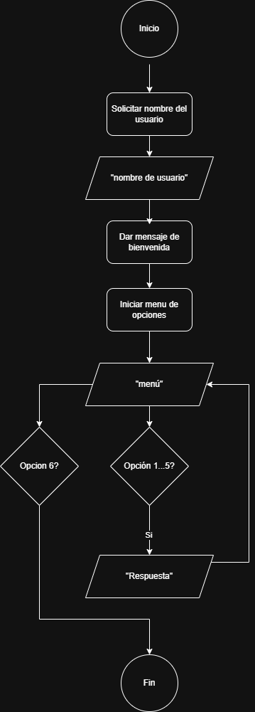

# Autores

 - Valentina Arias Acevedo 🇨🇴
 - Maria Fernanda Campos 🇻🇪
 - Elias Arroyo 🇦🇷
 - José Abraham Flores Munguía  🇵🇪
 - Yesenia Minhuey Espinoza 🇵🇪

# Tema
 Comercio retail Aurelion: venta, productos, comportamiento del cliente

# Problema
 El negocio retail no cuenta con reportes automatizados que permitan visualizar el comportamiento de ventas, identificar productos más demandados, ni analizar el rendimiento por categoría, ciudad o medio de pago. Esta falta de visibilidad limita la toma de decisiones estratégicas sobre inventario, promociones, segmentación de clientes y expansión comercial.

# Solución
 Diseñar un modelo de análisis de ventas mensual permitiendo:

 - Calcular el total de ventas por mes.
 - Identificar los productos más vendidos.
 - Agrupar ventas por categoría para detectar tendencias.
 - Facilitar visualizaciones y reportes automatizados.
 - Tendencia de ganancias por mes.
 - Medio de pago más usado.
 - Ciudad con más compras.
 - Top clientes.
 - Producto más vendido.
 - Tiempo de conversión (Alta de la cuenta -> Primera compra).
 - LTV de clientes por ciudad.
 - (Añadido) Analizar correlaciones entre variables clave (ej. cantidad vs importe).
 - (Añadido) Detectar y analizar outliers (ventas atípicas) para identificar clientes de alto valor.

# Estructura, tipos y escala de la base de datos

 La base de datos está organizada en formato tabular (filas y columnas), con claves únicas que permiten vincular entidades. Cada tabla representa una entidad del negocio:

## `Clientes`
 Contiene información básica de los compradores registrados

 | Atributo       | Tipo de dato      | Escala de medición          |
 |----------------|-------------------|-----------------------------|
 | id_cliente     | Numérico (INT)    | Nominal (PK)                |
 | nombre_cliente | Texto    (STRING) | Nominal                     |
 | email          | Texto    (STRING) | Nominal                     |
 | ciudad         | Texto    (STRING) | Nominal                     |
 | fecha_alta     | Fecha    (DATE)   | Intervalo                   |

## `Productos`
 Registra los productos disponibles en el catálogo, incluyendo su categoría y precio

  | Atributo         | Tipo de dato      | Escala de medición          |
 |------------------|-------------------|-----------------------------|
 | id_producto      | Numérico (INT)    | Nominal (PK)                |
 | nombre_producto  | Texto    (STRING) | Nominal                     |
 | categoria        | Texto    (STRING) | Nominal                     |
 | precio_unitario  | Decimal  (FLOAT)  | Razón (con cero absoluto)   |

## `Ventas`
 Representa cada transacción realizada por los clientes

 | Atributo       | Tipo de dato     | Escala de medición          |
 |----------------|------------------|-----------------------------|
 | id_venta       | Numérico (INT)   | Nominal (PK)                |
 | fecha          | Fecha    (DATE)  | Intervalo                   |
 | id_cliente     | Numérico (INT)   | Nominal (FK)                |
 | nombre_cliente | Texto    (STRING)| Nominal                     |
 | email          | Texto    (STRING)| Nominal                     |
 | medio_pago     | Texto    (STRING)| Nominal                     |

## `Detalle_ventas`
 Desglosa cada venta con sus productos específicos

 | Atributo         | Tipo de dato     | Escala de medición          |
 |------------------|------------------|-----------------------------|
 | id_venta         | Numérico (INT)   | Nominal (FK)                |
 | id_producto      | Numérico (INT)   | Nominal (FK)                |
 | nombre_producto  | Texto    (STRING)| Nominal                     |
 | cantidad         | Entero   (INT)   | Razón                       |
 | precio_unitario  | Decimal  (FLOAT) | Razón                       |
 | importe          | Decimal  (FLOAT) | Razón                       |

# Limpieza de datos

## Objetivo
Preparar los archivos .xlsx para análisis de ventas, asegurando consistencia, completitud y validez de claves.

## Archivos tratados
- `Clientes.xlsx`
- `Productos.xlsx`
- `Ventas.xlsx`
- `Detalle_ventas.xlsx`

## Transformaciones aplicadas
- Conversión de fechas: Se estandarizaron las columnas `fecha_alta` y `fecha` desde formato serial de Excel a formato datetime estándar.
- Conversión de tipos numéricos: Se convirtieron las columnas `precio_unitario`, `cantidad` e `importe` de `int` a `float` para permitir cálculos decimales precisos.
- Eliminación de duplicados: Se ejecutó una verificación `.duplicated().sum()` en todas las tablas.
- Manejo de nulos: Se ejecutó una verificación `.isnull().sum()` en todas las tablas.
- Validación de claves foráneas: Se validó la integridad referencial entre:
    - `Ventas(id_cliente)` y `Clientes(id_cliente)`
    - `Detalle_ventas(id_producto)` y `Productos(id_producto)`
    - `Detalle_ventas(id_venta)` y `Ventas(id_venta)`
- Corrección de categorías: Se aplicó una función (`corregir_categoria`) para estandarizar la columna `categoria` en `Productos` (ej. "Alimentos" y "Limpieza") basándose en palabras clave en `nombre_producto`.

## Resultados
- Todos los DataFrames están limpios y listos para el análisis.
- Fechas estandarizadas en formato `datetime64[ns]`.
- No se encontraron valores nulos ni filas duplicadas en el dataset inicial.
- Se validó que todas las claves foráneas tienen correspondencia; no hay registros huérfanos.
- Categorías de productos corregidas y consistentes.
- Se exportaron los DataFrames limpios a formato `.csv` para su uso futuro:
    - `clientes_limpio.csv`
    - `productos_limpio.csv`
    - `ventas_limpio.csv`
    - `detalle_ventas_limpio.csv`

# Estadística Descriptiva y de Negocio

Se realizó un análisis estadístico descriptivo sobre el DataFrame unificado (merge de las 4 tablas).

## Métricas Generales
- Ingresos Totales: $2,651,417.00
- Ticket Promedio por Venta: $22,095.14
- Media del Importe (por item): $7,730.08
- Mediana del Importe (por item): $6,702.00

## Análisis de Negocio (Agrupaciones)
- Ventas por Categoría:
    - `Alimentos`: $2,250,841.00  
    - `Limpieza`: $400,576.00 

 La categoría Alimentos lidera las ventas, lo que sugiere priorizar inventario y promociones en este segmento

- Medios de Pago más usados:
    - `Efectivo`: 32.36%
    - `QR`: 26.53%
    - `Transferencia`: 20.99%
    - `Tarjeta`: 20.12%

 El pago en efectivo sigue siendo el más usado, pero QR muestra una adopción significativa que puede aprovecharse para campañas digitales. QR y transferencia están en crecimiento. Se recomienda facilitar estos métodos en la tienda

- Ventas Totales por Mes (2024):
    - Enero: $529,840.0
    - Febrero: $407,041.0
    - Marzo: $388,263.0
    - Abril: $251,524.0
    - Mayo: $561,832.0
    - Junio: $512,917.0

 La gráfica de tendencia muestra una caída significativa en abril y un pico en mayo. Existe estacionalidad en las ventas. Se recomienda reforzar campañas en meses bajos y replicar estrategias exitosas de mayo|

## Calidad del Dato (Distribución)
- Interpretación (Media vs. Mediana): La Media ($7,730.08) es significativamente más alta que la Mediana ($6,702.00).
- Conclusión: Esto indica una distribución sesgada a la derecha. Existen algunas ventas con un 'importe' muy alto (outliers) que 'inflan' el promedio. Para este caso, la Mediana es una medida más confiable del 'importe' típico.

## KPIs Adicionales de Negocio (Resultados del Análisis)

### Top Ciudades (por Importe Total de Compras)
| Ciudad | Importe Total |
| :--- | :--- |
| Rio Cuarto | $792,203.00 |
| Alta Gracia | $481,504.00 |
| Cordoba | $481,482.00 |
| Carlos Paz | $353,852.00 |
| Villa Maria | $313,350.00 |
 Río Cuarto es el mercado más fuerte. Se recomienda priorizar inventario y promociones en esa ciudad. Concentra la mayoría de las ventas, lo que la convierte en el mercado prioritario para expansión y fidelización

### Top Clientes (por Importe Total)
| ID Cliente | Importe Total |
| :--- | :--- |
| 5 | $132,158.00 |
| 56 | $90,701.00 |
| 52 | $90,522.00 |
| 25 | $81,830.00 |
| 1 | $72,448.00 |
 Estos clientes representan alto valor. Se recomienda diseñar estrategias de fidelización personalizadas. Los clientes de alto valor representan un segmento clave para programas de fidelización y beneficios exclusivos

### Top Productos (por Cantidad Vendida)
| Producto | Cantidad Total | Importe Generado |
| :--- | :--- | :--- |
| Salsa de Tomate 500g | 27.0 | $23,949.00 |
| Queso Rallado 150g | 26.0 | $89,544.00 |
| Hamburguesas Congeladas x4 | 24.0 | $58,080.00 |
| Vino Blanco 750ml | 22.0 | $59,048.00 |
| Aceitunas Verdes 200g | 22.0 | $55,440.00 |
 Aunque Salsa de Tomate 500g lidera en cantidad, Queso Rallado 150g genera el mayor ingreso, lo que lo posiciona como producto estrella. Esta diferencia entre volumen y valor permite identificar productos de alta rotación y otros de alto margen, útiles para definir estrategias de inventario y promociones. Estos productos deben mantenerse en stock y puede usarse como gancho promocional

### Tiempo Promedio de Conversión
- **Definición:** (Alta de Cuenta -> Primera Compra)
- **Promedio:** 387.03 días

 Aunque algunos clientes compran pronto, muchos tardan meses en convertir. Esto revela una oportunidad clara para mejorar el proceso de activación inicial, como campañas de bienvenida, descuentos para nuevos usuarios o recordatorios automatizados.

### LTV (Lifetime Value) Promedio por Ciudad
| Ciudad | LTV Promedio |
| :--- | :--- |
| Rio Cuarto | $44,011.28 |
| Cordoba | $43,771.09 |
| Carlos Paz | $39,316.89 |
| Villa Maria | $39,168.75 |
| Alta Gracia | $34,393.14 |
 Río Cuarto no solo lidera en volumen, también en valor por cliente. Es el mercado más rentable.

### Visualizaciones Generadas
 Se realizaron diferentes gráficos y una matriz para representar los resultados del análisis:
 - Línea de tendencia de ventas totales por mes.
 - Barras con el top 5 productos por cantidad vendida.
 - Circular con la distribución de medios de pago.
 - Boxplot para detección de outliers en importes.
 - Heatmap de correlaciones entre variables clave.

# Análisis de Correlación (Pearson)

Se generó una matriz de correlación para entender la relación entre las variables clave del negocio.

### Interpretación de los resultados

a) cantidad vs importe → 0.60 (correlación positiva moderada)
Cuantas más unidades se venden, mayor es el importe total de la venta. Confirma la relación esperada. Sin embargo, no es perfecta, sugiriendo que el precio también influye fuertemente.

b) precio_unitario vs importe → 0.68 (correlación positiva moderada-alta)
A mayor precio, mayor importe total. El precio influye en los ingresos incluso más que la cantidad. Esto ayuda a definir una estrategia de “productos estrella”.

c) precio_unitario vs cantidad → –0.07 (correlación ligeramente negativa)
Relación muy débil. El cliente promedio no reacciona fuertemente a cambios de precio, lo que da margen para ajustes de precios sin un gran impacto en la cantidad vendida.

d) consumo_promedio_cliente vs importe → 0.49 (correlación positiva moderada)
Los clientes que suelen tener un consumo promedio alto (tickets grandes) también generan ventas de mayor importe. Refleja la importancia de fidelizar a este segmento.

e) compras_por_cliente vs consumo_promedio_cliente → –0.12 (correlación negativa débil)
Los clientes que compran más veces (frecuentes) tienden a tener un ticket promedio ligeramente menor. Esto es común: clientes frecuentes hacen compras pequeñas pero constantes.

f) compras_por_cliente vs importe → –0.06 (sin relación significativa)
La frecuencia de compra no se relaciona directamente con el monto de cada venta individual. Refuerza la necesidad de segmentar la base de clientes.

# Análisis de Outliers (Valores Atípicos)

Se utilizó el método del Rango Intercuartílico (IQR) para detectar ventas inusualmente grandes.

Resultados Clave:
- Q1 (25% inferior): $3,489.00
- Q3 (75% inferior): $10,231.50
- IQR: $6,742.50
- Límite Superior para Outliers: $20,345.25

Se identificaron 7 ventas como outliers, todas ellas por encima del límite superior.

### Nuestro Análisis de Outliers: Clave para la Tienda

Como equipo, decidimos usar el Rango Intercuartílico (IQR) para detectar ventas inusualmente grandes o pequeñas (outliers). Elegimos el IQR porque se enfoca en el 50% central de nuestras ventas, dándonos una base sólida para definir lo 'normal' y evitar que promedios se distorsionen por ventas extremas.

Estos 7 outliers de alto valor son cruciales para nosotros:

1.  Clientes de Alto Valor: Probablemente corresponden a clientes importantes. Nos permite diseñar estrategias de fidelización específicas para ellos.
2.  Productos con Potencial: Nos ayuda a identificar qué productos se venden en grandes cantidades. Nos señala nuestros 'productos estrella' para optimizar inventario y ofertas.
3.  Estrategias de Venta: Nos indica qué medios de pago son populares para grandes transacciones.
4.  Potencial de Crecimiento: Estos outliers nos muestran el techo de lo que podemos lograr por transacción, impulsándonos a replicar esas condiciones.

# Diseño ML para Aurelion
 ## Modelo de Clasificación de Clientes de Alto Valor
  
  - Objetivo:
  Clasificar si un cliente es de alto valor (1) o no (0) según su historial de compras, con el fin de activar estrategias de fidelización y priorización comercial.

  - Algoritmo elegido y justificación:
  Se utilizó Logistic Regression de scikit-learn. Este algoritmo es adecuado para clasificación binaria, es interpretable y funciona bien en datasets pequeños.

  - Entradas (X):
  `frecuencia_compra`: número de compras realizadas por cliente.
  `ticket_promedio`: impromedio por compra.
  `total_items`: cantidad total de productos comprados.

  - Salida (y):
  `alto_valor`: etiqueta binaria (1 = cliente de alto valor, 0 = cliente regular), definida por el percentil 75 del LTV.

  - Métricas de Evaluación y calculadas:
  Para evaluar el rendimiento del modelo de clasificación de clientes de alto valor se utilizaron métricas como accuracy, matriz de confusión, reporte de clasificación y validación cruzada.

1. Accuracy (Precisión global)

     Definición: Proporción de predicciones correctas sobre el total de casos.

      Resultado:[ Accuracy = 1.0 ; (100%) ] El modelo clasificó correctamente todos los clientes en el conjunto de prueba.

2. Matriz de Confusión
      |Real\\Predicho	|0 (Regular)|1(Alto valor)|
      | :--- | :--- | :--- | 
      |0  (Regular)	    |14	|0|
      |1 (Alto valor)	|0	|7|
      El modelo no cometió errores, clasificando correctamente los 14 clientes regulares y los 7 clientes alto valor.

3. Reporte de clasificación

               precision    recall  f1-score   support

           0       1.00      1.00      1.00        14
           1       1.00      1.00      1.00         7

        accuracy                           1.00        21
        macro avg       1.00      1.00      1.00        21
        weighted avg       1.00      1.00      1.00        21

     El modelo alcanzó valores perfectos (1.00) en todas las métricas.
     Clasificó correctamente los 14 clientes regulares y los 7 clientes alto valor.
     El soporte muestra que el conjunto de prueba tenía 21 clientes en total.
     El macro promedio y el weighted promedio confirman que el rendimiento es equilibrado entre ambas clases.

4. Validación Cruzada

    Accuracy promedio ≈ 0.97 Esto confirma que el modelo generaliza bien y no está sobreajustado.

- División Train/Test y entrenamiento, predicciones: 
  1. Se utilizó la función train_test_split de scikit-learn.
  2. El dataset se dividió en:
  3. 70% para entrenamiento (train) → datos usados para ajustar el modelo.
  4. 30% para prueba (test) → datos reservados para evaluar el rendimiento.
  5. Se fijó un random_state=42 para garantizar reproducibilidad
  6. Se eligió Logistic Regression de scikit-learn.
  7. Se configuró con max_iter=500 para garantizar que el algoritmo converja correctamente, ya que por defecto puede quedarse corto en datasets con más variabilidad.
  8. El modelo se entrenó con el conjunto de entrenamiento (X_train, y_train). En este proceso, el algoritmo ajusta los coeficientes de cada variable para estimar la probabilidad de que un cliente sea alto valor.
  9. El modelo aprendió a distinguir entre clientes alto valor (1) y regulares (0) en función de las variables de entrada.
  10. Posteriormente se aplicó el modelo al conjunto de prueba (X_test) para generar predicciones (y_pred) y calcular métricas de rendimiento.

 Las predicciones muestran que el modelo clasificó correctamente todos los clientes en el conjunto de prueba, y las métricas calculadas (accuracy, matriz de confusión, reporte de clasificación y validación cruzada) confirman un rendimiento excelente y consistente.

- Gráficos Generados:
   Heatmap de la Matriz de Confusión
   
   Propósito: Visualizar el rendimiento del modelo clasificando clientes como alto valor (1) o regulares (0).
   
   El gráfico muestra una matriz 2x2 con los valores reales vs. predichos.

   El modelo clasificó correctamente todos los casos:
   
   14 clientes regulares (0) fueron clasificados como regulares.
   
   7 clientes alto valor (1) fueron clasificados como alto valor.
   
   No hubo falsos positivos ni falsos negativos.
   
   Conclusión: El modelo tuvo un rendimiento perfecto en el conjunto de prueba.

# Información que se consultará

El programa consultara el archivo "documentación.md" para brindar el usuario la documentación tecnica del proyecto, en este se incluye:

- Problema identificado, la solución propuesta.
- Información sobre la base datos (tablas, atributos, tipo de datos y escala de medición).
- Resultados de limpieza, análisis descriptivo, correlaciones y outliers.
- Diseño del modelo ML (Machine Learning).

# Proceso de desarrollo

- Se planteo el tema, problema y solución.
- Se reunió el equipo para discutir lo planteado.
- Se agregaron nuevos detalles para la solución.
- Se revisó la base de datos brindada y se elavoró la estructura de la base de datos.
- Se ejecutó la limpieza y análisis exploratorio en Google Colab.
- Se documentaron los hallazgos del análisis.
- Finalmente se planteó el pseudocodigo para la estructura del programa para desarrollarlo en python.
- Se desarrollo un modelo ML (Machine Learning) para la clasificación de clientes de alto valor.
- Se desarrollo un tablero enfocado en las necesidades del negocio y el seguimiento de KPIs estratégicos en power bi.

# Pasos

- Cargar en memoria los textos de esta documentación.
- Mostrar un menú númerico con las secciones enumeradas.
- Según la opción elegida, imprimir el texto en pantalla.
- El programa estará en un bucle hasta que el usuario presione salir.

# Pseudocodigo

 INICIAR

 CARGAR textos en memoria

 DAR mensaje de bienvenida

 SOLICITAR nombre al usuario

 INICIAR un bucle while

 MOSTRAR menú con opciones:

 1 - Autores
 2 - Tema del proyecto
 3 - Problema
 4 - Soluciones
 5 - Estructura base de datos
 6 - Limpieza de Datos
 7 - Análisis Descriptivo y de negocio
 8 - Análisis de Correlación
 9 - Análisis de Outliers
 10 - Diseño ML
 0 - Salir

 SI selecciona una opción del 1 al 10 se le mostrara la información correspondiente

 SI selecciona 0 saldrá del menú y se muestra mensaje de despedida

 FIN

 # Diagrama
 